# Data Integration Part 1

<!-- Integrating Data Sources
Using Data Hub: Preview blob & DB data, T-SQL (On-Demand) and PySpark DataFrame
Orchestrate Hub: Connectors, Copy data

Studio - Manage Hub
Studio - Linked services
Studio - Integration runtimes

Large IR (32 cores) speed test:
    - General: 6:45
    - Memory: 3:29
    - Compute: 3:23

Heap vs. Clustered Columnstore speed test (insert January data (~248 million rows))
    - Clustered Columnstore: ~4:15 (~3:45 without staging enabled)
    - Heap: ~3:31 (~3:05 without staging enabled (~2:50 with 32 DIUs and concurrency = 50))

PolyBase vs COPY T-SQL (insert January data (~248 million rows))
    - COPY (2:38)
    - PolyBase (3:13)

PolyBase vs COPY T-SQL (DW2000) (insert small data set (2,903,451,490 rows))
    - COPY (Heap: 18:06)
    - PolyBase (Heap: 18:19)

PolyBase vs COPY T-SQL (DW2000) (insert 2019/Q4 small data set (35,813,682 rows))
    - COPY (Heap: 3:02)
    - PolyBase (Heap: 18:19)

PolyBase vs COPY T-SQL (DW2000) (insert 2019 small data set (339,507,246 rows))
    - COPY (Heap: 2:31, Clustered Columnstore: 3:26)
    - PolyBase (Heap: 2:38)

2019/Q4 path: https://asadatalake01.dfs.core.windows.net/wwi-02/sale-small%2FYear%3D2019%2FQuarter%3DQ4
-->

## Resource naming throughout this lab

For the remainder of this guide, the following terms will be used for various ASA-related resources (make sure you replace them with actual names and values):

| Azure Synapse Analytics Resource  | To be referred to |
| --- | --- |
| Workspace resource group | `WorkspaceResourceGroup` |
| Workspace / workspace name | `Workspace` |
| Primary Storage Account | `PrimaryStorage` |
| Default file system container | `DefaultFileSystem` |
| SQL Pool | `SqlPool01` |

## Exercise 1: Configure linked service and create datasets

### Task 1: Create linked service

Our data sources for labs 1 and 2 include files stored in ADLS Gen2 and Azure Cosmos DB. The linked service for ADLS Gen2 already exists as it is the primary ADLS Gen2 account for the workspace.

1. Open Synapse Analytics Studio (<https://web.azuresynapse.net/>). If you see a prompt to select your Synapse Analytics workspace, select the Azure subscription and workspace name used for the lab. When using a hosted lab environment, the workspace name will end with the same SUFFIX as your user name, as shown in the screenshot below. Make note of the suffix, as it is referenced throughout this and the remaining labs.

    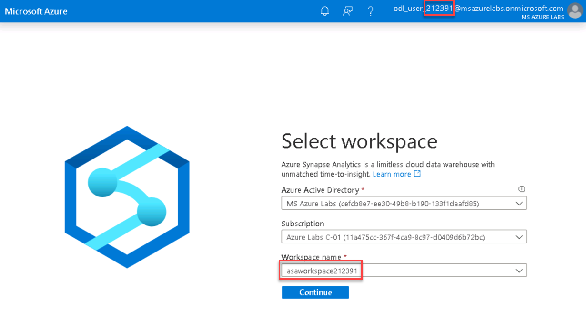

2. If this is your first time connecting to the Synapse Analytics workspace, you may see the _Getting started_ prompt. Select **Close** to continue.

    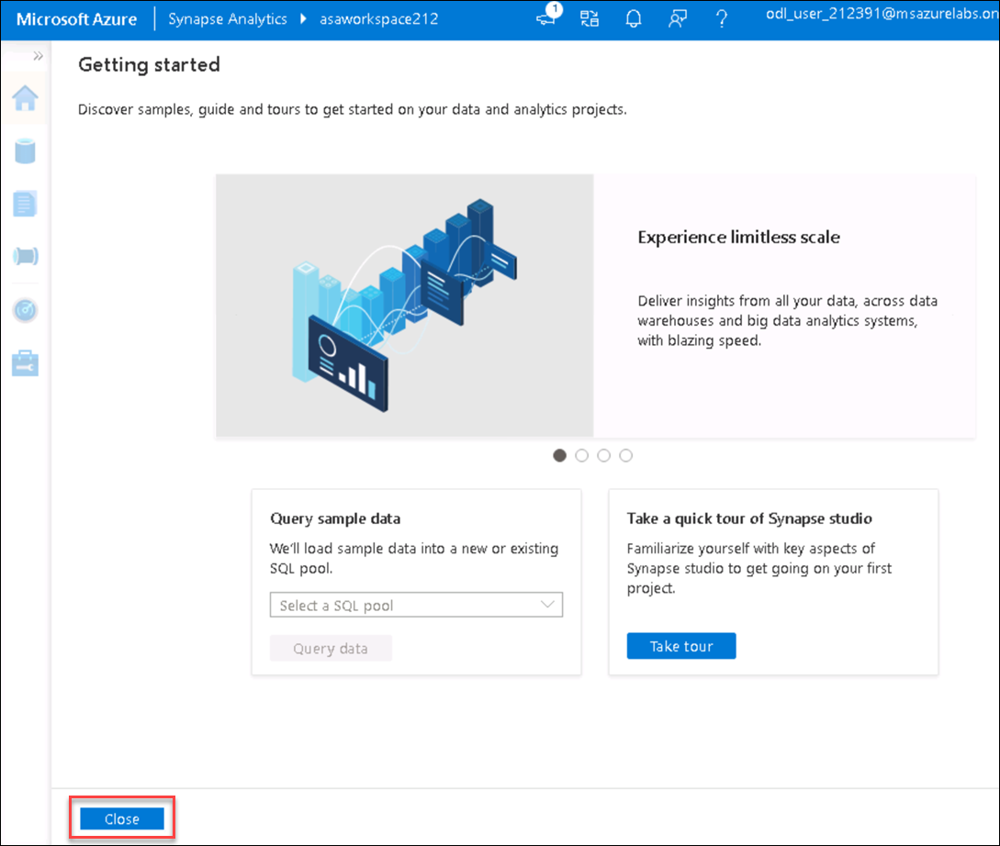

3. After connecting to the Synapse Analytics workspace, navigate to the **Manage** hub.

    

4. Open **Linked services** and select **+ New** to create a new linked service. Select **Azure Cosmos DB (SQL API)** in the list of options, then select **Continue**.

    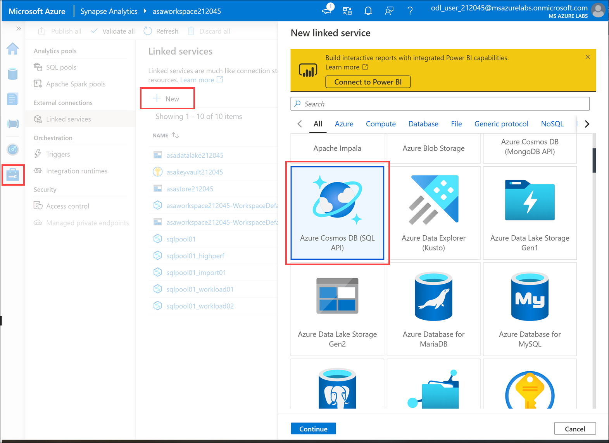

5. Name the linked service `asacosmosdb01` and set the **Database name** value to `CustomerProfile`.

    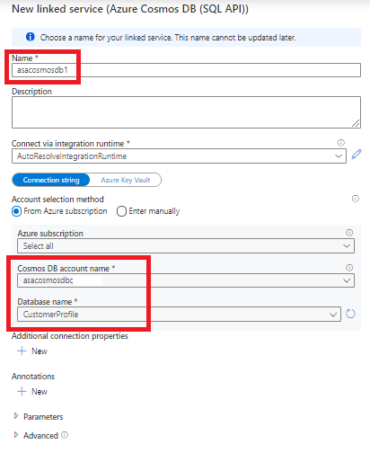

### Task 2: Create datasets

1. Navigate to the **Data** hub.

    

2. With the Workspace tab selected under Data, select **+** in the toolbar, then select **Dataset** to create a new dataset.

    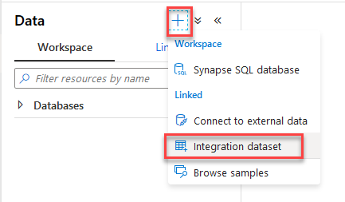

3. Create a new **Azure Cosmos DB (SQL API)** dataset with the following characteristics:

    - **Name**: Enter `asal400_customerprofile_cosmosdb`.
    - **Linked service**: Select the Azure Cosmos DB linked service.
    - **Collection**: Select `OnlineUserProfile01`.

    

4. After creating the dataset, navigate to its **Connection** tab, then select **Preview data**.

    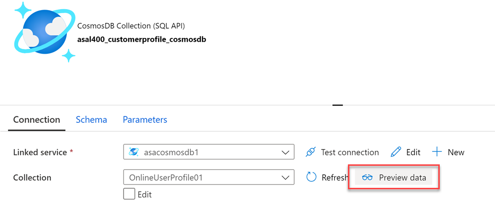

5. Preview data queries the selected Azure Cosmos DB collection and returns a sample of the documents within. The documents are stored in JSON format and include a `userId` field, `cartId`, `preferredProducts` (an array of product IDs that may be empty), and `productReviews` (an array of written product reviews that may be empty). We will use this data in lab 2.

    

6. Select the **Schema** tab, then select **Import schema**. Synapse Analytics evaluates the JSON documents within the collection and infers the schema based on the nature of the data within. Since we are only storing one document type in this collection, you will see the inferred schema for all documents within.

    

7. Create a new **Azure Data Lake Storage Gen2** dataset with the **Parquet** format type with the following characteristics:

    - **Name**: Enter `asal400_sales_adlsgen2`.
    - **Linked service**: Select the `asadatalakeXX` linked service that already exists.
    - **File path**: Browse to the `wwi-02/sale-small` path.
    - **Import schema**: Select `From connection/store`.

    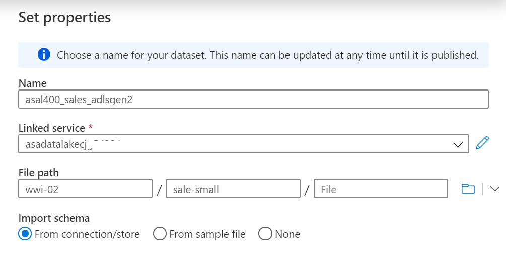

8. Create a new **Azure Data Lake Storage Gen2** dataset with the **JSON** format type with the following characteristics:

    - **Name**: Enter `asal400_ecommerce_userprofiles_source`.
    - **Linked service**: Select the `asadatalakeXX` linked service that already exists.
    - **File path**: Browse to the `wwi-02/online-user-profiles-02` path.
    - **Import schema**: Select `From connection/store`.

9. Select **Publish all**, then **Publish** to save your new resources.

    

## Exercise 2: Explore source data in the Data hub

Understanding data through data exploration is one of the core challenges faced today by data engineers and data scientists as well. Depending on the underlying structure of the data as well as the specific requirements of the exploration process, different data processing engines will offer varying degrees of performance, complexity, and flexibility.

In Azure Synapse Analytics, you have the possibility of using either the Synapse SQL Serverless engine, the big-data Spark engine, or both.

In this exercise, you will explore the data lake using both options.

### Task 1: Query sales Parquet data with Synapse SQL Serverless

When you query Parquet files using Synapse SQL Serverless, you can explore the data with T-SQL syntax.

1. In Synapse Analytics Studio, navigate to the **Data** hub.

    

2. Select the **Linked** tab and expand **Storage accounts**. Expand the `asaworkspaceXX` primary ADLS Gen2 account and select `wwi-02`.

3. Navigate to the `sale-small/Year=2016/Quarter=Q4/Month=12/Day=20161231` folder. Right-click on the `sale-small-20161231-snappy.parquet` file, select **New SQL script**, then **Select TOP 100 rows**.

    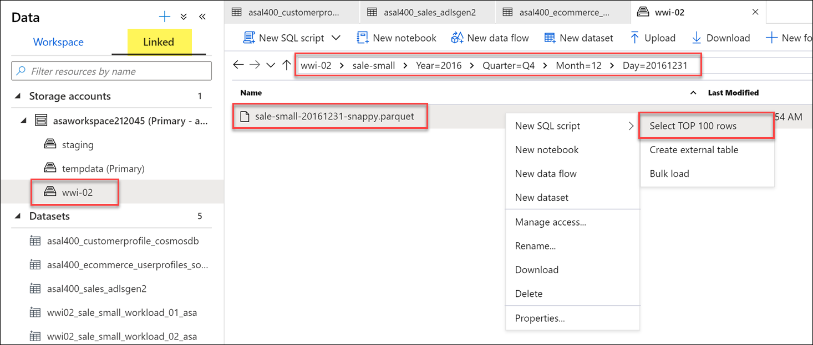

4. Ensure **SQL on-demand** is selected in the `Connect to` dropdown list above the query window, then run the query. Data is loaded by the Synapse SQL Serverless endpoint and processed as if was coming from any regular relational database.

    

5. Modify the SQL query to perform aggregates and grouping operations to better understand the data. Replace the query with the following, making sure that the file path in `OPENROWSET` matches your current file path:

    ```sql
    SELECT
        TransactionDate, ProductId,
            CAST(SUM(ProfitAmount) AS decimal(18,2)) AS [(sum) Profit],
            CAST(AVG(ProfitAmount) AS decimal(18,2)) AS [(avg) Profit],
            SUM(Quantity) AS [(sum) Quantity]
    FROM
        OPENROWSET(
            BULK 'https://asadatalakeSUFFIX.dfs.core.windows.net/wwi-02/sale-small/Year=2016/Quarter=Q4/Month=12/Day=20161231/sale-small-20161231-snappy.parquet',
            FORMAT='PARQUET'
        ) AS [r] GROUP BY r.TransactionDate, r.ProductId;
    ```

    

6. Now let's figure out how many records are contained within the Parquet files for 2019 data. This information is important for planning how we optimize for importing the data into Azure Synapse Analytics. To do this, replace your query with the following (be sure to update the name of your data lake in BULK statement, by replacing `[asadatalakeSUFFIX]`):

    ```sql
    SELECT
        COUNT(*)
    FROM
        OPENROWSET(
            BULK 'https://asadatalakeSUFFIX.dfs.core.windows.net/wwi-02/sale-small/Year=2019/*/*/*/*',
            FORMAT='PARQUET'
        ) AS [r];
    ```

    > Notice how we updated the path to include all Parquet files in all subfolders of `sale-small/Year=2019`.

    The output should be **339507246** records.

    Optional: If you wish to keep this SQL script for future reference, select the Properties button, provide a descriptive name, such as `ASAL400 - Lab1 - Explore sales data`, then select **Publish all**.

    

### Task 2: Query sales Parquet data with Azure Synapse Spark

1. Navigate to the **Data** hub, browse to the data lake storage account folder `sale-small/Year=2010/Quarter=Q4/Month=12/Day=20161231` if needed, then right-click the Parquet file and select New notebook.

    

2. This will generate a notebook with PySpark code to load the data in a dataframe and display 100 rows with the header.

3. Attach the notebook to a Spark pool.

    

4. Update the cell to **remove** the `%%pyspark` line. If you do not do this, you will receive an error when you update the cell during the steps that follow.

5. Select **Run all** on the notebook toolbar to execute the notebook.

    > **Note:** The first time you run a notebook in a Spark pool, Synapse creates a new session. This can take approximately 3-5 minutes.

    > **Note:** To run just the cell, either hover over the cell and select the _Run cell_ icon to the left of the cell, or select the cell then type **Ctrl+Enter** on your keyboard.

6. Create a new cell underneath by selecting **{} Add code** when hovering over the blank space at the bottom of the notebook.

    

7. The Spark engine can analyze the Parquet files and infer the schema. To do this, enter the following in the new cell:

```python
data_path.printSchema()
```

Your output should look like the following:

```text
root
    |-- TransactionId: string (nullable = true)
    |-- CustomerId: integer (nullable = true)
    |-- ProductId: short (nullable = true)
    |-- Quantity: short (nullable = true)
    |-- Price: decimal(29,2) (nullable = true)
    |-- TotalAmount: decimal(29,2) (nullable = true)
    |-- TransactionDate: integer (nullable = true)
    |-- ProfitAmount: decimal(29,2) (nullable = true)
    |-- Hour: byte (nullable = true)
    |-- Minute: byte (nullable = true)
    |-- StoreId: short (nullable = true)
```

8. Now let's use the dataframe to perform the same grouping and aggregate query we performed with the SQL Serverless pool. Create a new cell and enter the following:

```python
from pyspark.sql import SparkSession
from pyspark.sql.types import *
from pyspark.sql.functions import *

profitByDateProduct = (data_path.groupBy("TransactionDate","ProductId")
    .agg(
        sum("ProfitAmount").alias("(sum)ProfitAmount"),
        round(avg("Quantity"), 4).alias("(avg)Quantity"),
        sum("Quantity").alias("(sum)Quantity"))
    .orderBy("TransactionDate"))
profitByDateProduct.show(100)
```

 > We import required Python libraries to use aggregation functions and types defined in the schema to successfully execute the query.

### Task 3: Query user profile JSON data with Azure Synapse Spark

In addition to the sales data, we have customer profile data from an e-commerce system that provides top product purchases for each visitor of the site (customer) over the past 12 months. This data is stored within JSON files in the data lake. We will import this data in the next lab, but let's explore it while we're in the Spark notebook.

1. Create a new cell in the Spark notebook, enter the following code, replace `<asadatalakeNNNNNN>` with your data lake name (you can find this value in the first cell of the notebook), and execute the cell:

```python
df = (spark.read \
        .option("inferSchema", "true") \
        .json("abfss://wwi-02@asadatalakeSUFFIX.dfs.core.windows.net/online-user-profiles-02/*.json", multiLine=True)
    )

df.printSchema()
```

Your output should look like the following:

```text
root
|-- topProductPurchases: array (nullable = true)
|    |-- element: struct (containsNull = true)
|    |    |-- itemsPurchasedLast12Months: long (nullable = true)
|    |    |-- productId: long (nullable = true)
|-- visitorId: long (nullable = true)
```

> Notice that we are selecting all JSON files within the `online-user-profiles-02` directory. Each JSON file contains several rows, which is why we specified the `multiLine=True` option. Also, we set the `inferSchema` option to `true`, which instructs the Spark engine to review the files and create a schema based on the nature of the data.

2. We have been using Python code in these cells up to this point. If we want to query the files using SQL syntax, one option is to create a temporary view of the data within the dataframe. Execute the following in a new cell to create a view named `user_profiles`:

    ```python
    # create a view called user_profiles
    df.createOrReplaceTempView("user_profiles")
    ```

3. Create a new cell. Since we want to use SQL instead of Python, we use the `%%sql` magic to set the language of the cell to SQL. Execute the following code in the cell:

    ```sql
    %%sql

    SELECT * FROM user_profiles LIMIT 10
    ```

Notice that the output shows nested data for `topProductPurchases`, which includes an array of `productId` and `itemsPurchasedLast12Months` values. You can expand the fields by clicking the right triangle in each row.


This makes analyzing the data a bit difficult. This is because the JSON file contents look like the following:

```json
[
{
    "visitorId": 9529082,
    "topProductPurchases": [
    {
        "productId": 4679,
        "itemsPurchasedLast12Months": 26
    },
    {
        "productId": 1779,
        "itemsPurchasedLast12Months": 32
    },
    {
        "productId": 2125,
        "itemsPurchasedLast12Months": 75
    },
    {
        "productId": 2007,
        "itemsPurchasedLast12Months": 39
    },
    {
        "productId": 1240,
        "itemsPurchasedLast12Months": 31
    },
    {
        "productId": 446,
        "itemsPurchasedLast12Months": 39
    },
    {
        "productId": 3110,
        "itemsPurchasedLast12Months": 40
    },
    {
        "productId": 52,
        "itemsPurchasedLast12Months": 2
    },
    {
        "productId": 978,
        "itemsPurchasedLast12Months": 81
    },
    {
        "productId": 1219,
        "itemsPurchasedLast12Months": 56
    },
    {
        "productId": 2982,
        "itemsPurchasedLast12Months": 59
    }
    ]
},
{
    ...
},
{
    ...
}
]
```

4. PySpark contains a special [`explode` function](https://spark.apache.org/docs/latest/api/python/pyspark.sql.html?highlight=explode#pyspark.sql.functions.explode), which returns a new row for each element of the array. This will help flatten the `topProductPurchases` column for better readability or for easier querying. Execute the following in a new cell:

```python
from pyspark.sql.functions import udf, explode

flat=df.select('visitorId',explode('topProductPurchases').alias('topProductPurchases_flat'))
flat.show(100)
```

In this cell, we created a new dataframe named `flat` that includes the `visitorId` field and a new aliased field named `topProductPurchases_flat`. As you can see, the output is a bit easier to read and, by extension, easier to query.


5. Create a new cell and execute the following code to create a new flattened version of the dataframe that extracts the `topProductPurchases_flat.productId` and `topProductPurchases_flat.itemsPurchasedLast12Months` fields to create new rows for each data combination:

```python
topPurchases = (flat.select('visitorId','topProductPurchases_flat.productId','topProductPurchases_flat.itemsPurchasedLast12Months')
    .orderBy('visitorId'))

topPurchases.show(100)
```

In the output, notice that we now have multiple rows for each `visitorId`.


6. Let's order the rows by the number of items purchased in the last 12 months. Create a new cell and execute the following code:

```python
# Let's order by the number of items purchased in the last 12 months
sortedTopPurchases = topPurchases.orderBy("itemsPurchasedLast12Months")

sortedTopPurchases.show(100)
```

7. How do we sort in reverse order? One might conclude that we could make a call like this: `topPurchases.orderBy("itemsPurchasedLast12Months desc")`. Try it in a new cell:

```python
topPurchases.orderBy("itemsPurchasedLast12Months desc")
```

Why does this not work?

- The `DataFrames` API is built upon an SQL engine.
- There is a lot of familiarity with this API and SQL syntax in general.
- The problem is that `orderBy(..)` expects the name of the column.
- What we specified was an SQL expression in the form of **requests desc**.
- What we need is a way to programmatically express such an expression.
- This leads us to the second variant, `orderBy(Column)` and more specifically, the class `Column`.

8. The **Column** class is an object that encompasses more than just the name of the column, but also column-level-transformations, such as sorting in a descending order. Execute the following code in a new cell:

```python
sortedTopPurchases = (topPurchases
    .orderBy( col("itemsPurchasedLast12Months").desc() ))

sortedTopPurchases.show(100)
```

9. How many *types* of products did each customer purchase? To figure this out, we need to group by `visitorId` and aggregate on the number of rows per customer. Execute the following code in a new cell:

```python
groupedTopPurchases = (sortedTopPurchases.select("visitorId")
    .groupBy("visitorId")
    .agg(count("*").alias("total"))
    .orderBy("visitorId") )

groupedTopPurchases.show(100)
```


10. How many *total items* did each customer purchase? To figure this out, we need to group by `visitorId` and aggregate on the sum of `itemsPurchasedLast12Months` values per customer. Execute the following code in a new cell:

```python
groupedTopPurchases = (sortedTopPurchases.select("visitorId","itemsPurchasedLast12Months")
    .groupBy("visitorId")
    .agg(sum("itemsPurchasedLast12Months").alias("totalItemsPurchased"))
    .orderBy("visitorId") )

groupedTopPurchases.show(100)
```


## Exercise 3: Import sales data with PolyBase and COPY using T-SQL

There are different options for loading large amounts and varying types of data into Azure Synapse Analytics, such as through T-SQL commands using a Synapse SQL Pool, and with Azure Synapse pipelines. In our scenario, Wide World Importers stores most of their raw data in a data lake and in different formats. Among the data loading options available to them, WWI's data engineers are most comfortable using T-SQL.

However, even with their familiarity with SQL, there are some things to consider when loading large or disparate file types and formats. Since the files are stored in ADLS Gen2, WWI can use either PolyBase external tables or the new COPY statement. Both options enable fast and scalable data load operations, but there are some differences between the two:

| PolyBase | COPY |
| --- | --- |
| GA, stable | Currently in preview |
| Needs `CONTROL` permission | Relaxed permission |
| Has row width limits | No row width limit |
| No delimiters within text | Supports delimiters in text |
| Fixed line delimiter | Supports custom column and row delimiters |
| Complex to set up in code | Reduces amount of code |

WWI has heard that PolyBase is generally faster than COPY, especially when working with large data sets. 

In this exercise, you will help WWI compare ease of setup, flexibility, and speed between these loading strategies.

### Task 1: Create staging tables

The `Sale` table has a columnstore index to optimize for read-heavy workloads. It is also used heavily for reporting and ad-hoc queries. To achieve the fastest loading speed and minimize the impact of heavy data inserts on the `Sale` table, WWI has decided to create a staging table for loads.

In this task, you will create a new staging table named `SaleHeap` in a new schema named `wwi_staging`. You will define it as a [heap](https://docs.microsoft.com/sql/relational-databases/indexes/heaps-tables-without-clustered-indexes?view=sql-server-ver15) and use round-robin distribution. When WWI finalizes their data loading pipeline, they will load the data into `SaleHeap`, then insert from the heap table into `Sale`. Although this is a two-step process, the second step of inserting the rows to the production table does not incur data movement across the distributions.

You will also create a new `Sale` clustered columnstore table within the `wwi_staging` to compare data load speeds.

1. Open Synapse Analytics Studio (<https://web.azuresynapse.net/>), and then navigate to the **Develop** hub.

    

2. From the **Develop** menu, select the + button and choose **SQL Script** from the context menu.

    

3. In the toolbar menu, connect to the **SQL Pool** database to execute the query.

    

4. In the query window, replace the script with the following to create the `wwi_staging` schema:

    ```sql
    CREATE SCHEMA [wwi_staging]
    ```

5. Select **Run** from the toolbar menu to execute the SQL command.

    

    > **Note:** If you receive the following error, continue to the next step: `Failed to execute query. Error: There is already an object named 'wwi_staging' in the database. CREATE SCHEMA failed due to previous errors.`

6. In the query window, replace the script with the following to create the heap table:

    ```sql
    CREATE TABLE [wwi_staging].[SaleHeap]
    ( 
        [TransactionId] [uniqueidentifier]  NOT NULL,
        [CustomerId] [int]  NOT NULL,
        [ProductId] [smallint]  NOT NULL,
        [Quantity] [smallint]  NOT NULL,
        [Price] [decimal](9,2)  NOT NULL,
        [TotalAmount] [decimal](9,2)  NOT NULL,
        [TransactionDate] [int]  NOT NULL,
        [ProfitAmount] [decimal](9,2)  NOT NULL,
        [Hour] [tinyint]  NOT NULL,
        [Minute] [tinyint]  NOT NULL,
        [StoreId] [smallint]  NOT NULL
    )
    WITH
    (
        DISTRIBUTION = ROUND_ROBIN,
        HEAP
    )
    ```

7. Select **Run** from the toolbar menu to execute the SQL command.

8. In the query window, replace the script with the following to create the `Sale` table in the `wwi_staging` schema for load comparisons:

    ```sql
    CREATE TABLE [wwi_staging].[Sale]
    (
        [TransactionId] [uniqueidentifier]  NOT NULL,
        [CustomerId] [int]  NOT NULL,
        [ProductId] [smallint]  NOT NULL,
        [Quantity] [smallint]  NOT NULL,
        [Price] [decimal](9,2)  NOT NULL,
        [TotalAmount] [decimal](9,2)  NOT NULL,
        [TransactionDate] [int]  NOT NULL,
        [ProfitAmount] [decimal](9,2)  NOT NULL,
        [Hour] [tinyint]  NOT NULL,
        [Minute] [tinyint]  NOT NULL,
        [StoreId] [smallint]  NOT NULL
    )
    WITH
    (
        DISTRIBUTION = HASH ( [CustomerId] ),
        CLUSTERED COLUMNSTORE INDEX,
        PARTITION
        (
            [TransactionDate] RANGE RIGHT FOR VALUES (20100101, 20100201, 20100301, 20100401, 20100501, 20100601, 20100701, 20100801, 20100901, 20101001, 20101101, 20101201, 20110101, 20110201, 20110301, 20110401, 20110501, 20110601, 20110701, 20110801, 20110901, 20111001, 20111101, 20111201, 20120101, 20120201, 20120301, 20120401, 20120501, 20120601, 20120701, 20120801, 20120901, 20121001, 20121101, 20121201, 20130101, 20130201, 20130301, 20130401, 20130501, 20130601, 20130701, 20130801, 20130901, 20131001, 20131101, 20131201, 20140101, 20140201, 20140301, 20140401, 20140501, 20140601, 20140701, 20140801, 20140901, 20141001, 20141101, 20141201, 20150101, 20150201, 20150301, 20150401, 20150501, 20150601, 20150701, 20150801, 20150901, 20151001, 20151101, 20151201, 20160101, 20160201, 20160301, 20160401, 20160501, 20160601, 20160701, 20160801, 20160901, 20161001, 20161101, 20161201, 20170101, 20170201, 20170301, 20170401, 20170501, 20170601, 20170701, 20170801, 20170901, 20171001, 20171101, 20171201, 20180101, 20180201, 20180301, 20180401, 20180501, 20180601, 20180701, 20180801, 20180901, 20181001, 20181101, 20181201, 20190101, 20190201, 20190301, 20190401, 20190501, 20190601, 20190701, 20190801, 20190901, 20191001, 20191101, 20191201)
        )
    )
    ```

9. Select **Run** from the toolbar menu to execute the SQL command.

### Task 2: Configure and run PolyBase load operation

PolyBase requires the following elements:

- An external data source that points to the `abfss` path in ADLS Gen2 where the Parquet files are located
- An external file format for Parquet files
- An external table that defines the schema for the files, as well as the location, data source, and file format

1. In the query window, replace the script with the following to create the external data source. Be sure to replace `<PrimaryStorage`>` with the default storage account name for your workspace:

    ```sql
    -- Replace <PrimaryStorage> with the workspace default storage account name.
    CREATE EXTERNAL DATA SOURCE ABSS
    WITH
    ( TYPE = HADOOP,
        LOCATION = 'abfss://wwi-02@asadatalakeSUFFIX.dfs.core.windows.net'
    );
    ```

2. Select **Run** from the toolbar menu to execute the SQL command.

3. In the query window, replace the script with the following to create the external file format and external data table. Notice that we defined `TransactionId` as an `nvarchar(36)` field instead of `uniqueidentifier`. This is because external tables do not currently support `uniqueidentifier` columns:

    ```sql
    CREATE EXTERNAL FILE FORMAT [ParquetFormat]
    WITH (
        FORMAT_TYPE = PARQUET, 
        DATA_COMPRESSION = 'org.apache.hadoop.io.compress.SnappyCodec'
    )
    GO

    CREATE SCHEMA [wwi_external];
    GO

    CREATE EXTERNAL TABLE [wwi_external].Sales
        (
            [TransactionId] [nvarchar](36)  NOT NULL,
            [CustomerId] [int]  NOT NULL,
            [ProductId] [smallint]  NOT NULL,
            [Quantity] [smallint]  NOT NULL,
            [Price] [decimal](9,2)  NOT NULL,
            [TotalAmount] [decimal](9,2)  NOT NULL,
            [TransactionDate] [int]  NOT NULL,
            [ProfitAmount] [decimal](9,2)  NOT NULL,
            [Hour] [tinyint]  NOT NULL,
            [Minute] [tinyint]  NOT NULL,
            [StoreId] [smallint]  NOT NULL
        )
    WITH
        (
            LOCATION = '/sale-small%2FYear%3D2019',  
            DATA_SOURCE = ABSS,
            FILE_FORMAT = [ParquetFormat]  
        )  
    GO
    ```

    > **Note:** The `/sale-small/Year=2019/` folder's Parquet files contain **339,507,246 rows**.

4. Select **Run** from the toolbar menu to execute the SQL command.

5. In the query window, replace the script with the following to load the data into the `wwi_staging.SalesHeap` table:

    ```sql
    INSERT INTO [wwi_staging].[SaleHeap]
    SELECT *
    FROM [wwi_external].[Sales]
    ```

6. Select **Run** from the toolbar menu to execute the SQL command. It will take a few minutes to execute this command. **Take note** of how long it took to execute this query.

7. In the query window, replace the script with the following to see how many rows were imported:

    ```sql
    SELECT COUNT(1) FROM wwi_staging.SaleHeap(nolock)
    ```

8. Select **Run** from the toolbar menu to execute the SQL command. You should see a result of `339507246`.

### Task 3: Configure and run the COPY statement

Now let's see how to perform the same load operation with the COPY statement.

1. In the query window, replace the script with the following to truncate the heap table and load data using the COPY statement. Be sure to replace `<PrimaryStorage`>` with the default storage account name for your workspace:

    ```sql
    TRUNCATE TABLE wwi_staging.SaleHeap;
    GO

    -- Replace <PrimaryStorage> with the workspace default storage account name.
    COPY INTO wwi_staging.SaleHeap
    FROM 'https://asadatalakeSUFFIX.dfs.core.windows.net/wwi-02/sale-small%2FYear%3D2019'
    WITH (
        FILE_TYPE = 'PARQUET',
        COMPRESSION = 'SNAPPY'
    )
    GO
    ```

2. Select **Run** from the toolbar menu to execute the SQL command. It takes a few minutes to execute this command. **Take note** of how long it took to execute this query.

3. In the query window, replace the script with the following to see how many rows were imported:

    ```sql
    SELECT COUNT(1) FROM wwi_staging.SaleHeap(nolock)
    ```

4. Select **Run** from the toolbar menu to execute the SQL command. You should see a result of `339507246`.

Do the number of rows match for both load operations? Which activity was fastest? You should see that both copied the same amount of data in roughly the same amount of time.

### Task 4: Load data into the clustered columnstore table

For both of the load operations above, we inserted data into the heap table. What if we inserted into the clustered columnstore table instead? Is there really a performance difference? Let's find out!

1. In the query window, replace the script with the following to load data into the clustered columnstore `Sale` table using the COPY statement. Be sure to replace `<PrimaryStorage`>` with the default storage account name for your workspace:

    ```sql
    -- Replace <PrimaryStorage> with the workspace default storage account name.
    COPY INTO wwi_staging.Sale
    FROM 'https://asadatalakeSUFFIX.dfs.core.windows.net/wwi-02/sale-small%2FYear%3D2019'
    WITH (
        FILE_TYPE = 'PARQUET',
        COMPRESSION = 'SNAPPY'
    )
    GO
    ```

2. Select **Run** from the toolbar menu to execute the SQL command. It takes a few minutes to execute this command. **Take note** of how long it took to execute this query.

3. In the query window, replace the script with the following to see how many rows were imported:

    ```sql
    SELECT COUNT(1) FROM wwi_staging.Sale(nolock)
    ```

4. Select **Run** from the toolbar menu to execute the SQL command.

What were the results? Did the load operation take more or less time writing to `Sale` table vs. the heap (`SaleHeap`) table?

In our case, the results are as follows:

PolyBase vs. COPY (DW2000) *(insert 2019 small data set (339,507,246 rows))*:

- COPY (Heap: **2:31**, clustered columnstore: **3:26**)
- PolyBase (Heap: **2:38**)

### Task 5: Use COPY to load text file with non-standard row delimiters

One of the advantages COPY has over PolyBase is that it supports custom column and row delimiters.

WWI has a nightly process that ingests regional sales data from a partner analytics system and saves the files in the data lake. The text files use non-standard column and row delimiters where columns are delimited by a `.` and rows by a `,`:

```text
20200421.114892.130282.159488.172105.196533,20200420.109934.108377.122039.101946.100712,20200419.253714.357583.452690.553447.653921
```

The data has the following fields: `Date`, `NorthAmerica`, `SouthAmerica`, `Europe`, `Africa`, and `Asia`. They must process this data and store it in Synapse Analytics.

1. In the query window, replace the script with the following to create the `DailySalesCounts` table and load data using the COPY statement. Be sure to replace `<PrimaryStorage`>` with the default storage account name for your workspace:

    ```sql
    CREATE TABLE [wwi_staging].DailySalesCounts
        (
            [Date] [int]  NOT NULL,
            [NorthAmerica] [int]  NOT NULL,
            [SouthAmerica] [int]  NOT NULL,
            [Europe] [int]  NOT NULL,
            [Africa] [int]  NOT NULL,
            [Asia] [int]  NOT NULL
        )
    GO

    -- Replace <PrimaryStorage> with the workspace default storage account name.
    COPY INTO wwi_staging.DailySalesCounts
    FROM 'https://asadatalakeSUFFIX.dfs.core.windows.net/wwi-02/campaign-analytics/dailycounts.txt'
    WITH (
        FILE_TYPE = 'CSV',
        FIELDTERMINATOR='.',
        ROWTERMINATOR=','
    )
    GO
    ```

    Notice the `FIELDTERMINATOR` and `ROWTERMINATOR` properties that help us correctly parse the file.

2. Select **Run** from the toolbar menu to execute the SQL command.

3. In the query window, replace the script with the following to view the imported data:

    ```sql
    SELECT * FROM [wwi_staging].DailySalesCounts
    ORDER BY [Date] DESC
    ```

4. Select **Run** from the toolbar menu to execute the SQL command.

5. Try viewing the results in a Chart and set the **Category column** to `Date`:

    

### Task 6: Use PolyBase to load text file with non-standard row delimiters

Let's try this same operation using PolyBase.

1. In the query window, replace the script with the following to create a new external file format, external table, and load data using PolyBase:

    ```sql
    CREATE EXTERNAL FILE FORMAT csv_dailysales
    WITH (
        FORMAT_TYPE = DELIMITEDTEXT,
        FORMAT_OPTIONS (
            FIELD_TERMINATOR = '.',
            DATE_FORMAT = '',
            USE_TYPE_DEFAULT = False
        )
    );
    GO

    CREATE EXTERNAL TABLE [wwi_external].DailySalesCounts
        (
            [Date] [int]  NOT NULL,
            [NorthAmerica] [int]  NOT NULL,
            [SouthAmerica] [int]  NOT NULL,
            [Europe] [int]  NOT NULL,
            [Africa] [int]  NOT NULL,
            [Asia] [int]  NOT NULL
        )
    WITH
        (
            LOCATION = '/campaign-analytics/dailycounts.txt',  
            DATA_SOURCE = ABSS,
            FILE_FORMAT = csv_dailysales
        )  
    GO
    INSERT INTO [wwi_staging].[DailySalesCounts]
    SELECT *
    FROM [wwi_external].[DailySalesCounts]
    ```

2. Select **Run** from the toolbar menu to execute the SQL command.

You should see an error similar to: `Failed to execute query. Error: HdfsBridge::recordReaderFillBuffer - Unexpected error encountered filling record reader buffer: HadoopExecutionException: Too many columns in the line.`.

Why is this? According to [PolyBase documentation](https://docs.microsoft.com/sql/t-sql/statements/create-external-file-format-transact-sql?view=sql-server-ver15#limitations-and-restrictions):

> The row delimiter in delimited-text files must be supported by Hadoop's LineRecordReader. That is, it must be either `\r`, `\n`, or `\r\n`. These delimiters are not user-configurable.

This is an example of where COPY's flexibility gives it an advantage over PolyBase.

## Exercise 4: Import sales data with COPY using a pipeline

Now that WWI has gone through the process of loading data using PolyBase and COPY via T-SQL statements, it's time for them to experiment with loading sales data through a Synapse pipeline.

When moving data into a data warehouse, there is oftentimes a level of orchestration involved, coordinating movement from one or more data sources and sometimes some level of transformation. The transformation step can occur during (extract-transform-load - ETL) or after (extract-load-transform - ELT) data movement. Any modern data platform must provide a seamless experience for all the typical data wrangling actions like extractions, parsing, joining, standardizing, augmenting, cleansing, consolidating, and filtering. Azure Synapse Analytics provides two significant categories of features - data flows and data orchestrations (implemented as pipelines).

In this exercise, we will focus on the orchestration aspect. Lab 2 will focus more on the transformation (data flow) pipelines. You will create a new pipeline to import a large Parquet file, following best practices to improve the load performance.

### Task 1: Configure workload management classification

When loading a large amount of data, it is best to run only one load job at a time for fasted performance. If this isn't possible, run a minimal number of loads concurrently. If you expect a large loading job, consider scaling up your SQL pool before the load.

Be sure that you allocate enough memory to the pipeline session. To do this, increase the resource class of a user which has permissions to rebuild the index on this table to the recommended minimum.

To run loads with appropriate compute resources, create loading users designated for running loads. Assign each loading user to a specific resource class or workload group. To run a load, sign in as one of the loading users, and then run the load. The load runs with the user's resource class.

1. In the query window, replace the script with the following to create a workload group, `BigDataLoad`, that uses workload isolation by reserving a minimum of 50% resources with a cap of 100%:

    ```sql
    IF NOT EXISTS (SELECT * FROM sys.workload_management_workload_classifiers WHERE group_name = 'BigDataLoad')
    BEGIN
        CREATE WORKLOAD GROUP BigDataLoad WITH  
        (
            MIN_PERCENTAGE_RESOURCE = 50 -- integer value
            ,REQUEST_MIN_RESOURCE_GRANT_PERCENT = 25 --  (guaranteed a minimum of 4 concurrency)
            ,CAP_PERCENTAGE_RESOURCE = 100
        );
    END
    ```

2. Select **Run** from the toolbar menu to execute the SQL command.

3. In the query window, replace the script with the following to create a new workload classifier, `HeavyLoader` that assigns the `asa.sql.import01` user we created in your environment to the `BigDataLoad` workload group. At the end, we select from `sys.workload_management_workload_classifiers` to view all classifiers, including the one we just created:

    ```sql
    IF NOT EXISTS (SELECT * FROM sys.workload_management_workload_classifiers WHERE [name] = 'HeavyLoader')
    BEGIN
        CREATE WORKLOAD Classifier HeavyLoader WITH
        (
            Workload_Group ='BigDataLoad',
            MemberName='asa.sql.import01',
            IMPORTANCE = HIGH
        );
    END

    SELECT * FROM sys.workload_management_workload_classifiers
    ```

4. Select **Run** from the toolbar menu to execute the SQL command. You should see the new classifier in the query results:

    

5. Navigate to the **Manage** hub.

    

6. Locate and select a linked service named `sqlpool01_import01`. Notice that the user name for the SQL Pool connection is the `asa.sql.import01` user we added to the `HeavyLoader` classifier. We will use this linked service in our new pipeline to reserve resources for the data load activity.

    

### Task 2: Create pipeline with copy activity

1. Navigate to the **Orchestrate** hub.

    

2. Select + then **Pipeline** to create a new pipeline.

    

3. In the **Properties** pane for the new pipeline, enter the following **Name**: `ASAL400 - Copy December Sales`.

    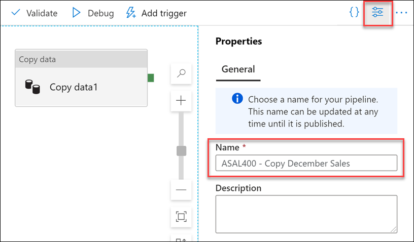

4. Expand **Move & transform** within the Activities list, then drag the **Copy data** activity onto the pipeline canvas.

    

5. Select the **Copy data** activity on the canvas and set the **Name** to `Copy Sales`.

6. Select the **Source** tab, then select **+ New** next to `Source dataset`.

7. Select the **Azure Data Lake Storage Gen2** data store, then select **Continue**.

8. Choose the **Parquet** format, then select **Continue**.

9. In the properties, set the name to **asal400_december_sales** and select the **asadatalakeNNNNNN** linked service. Browse to the `wwi-02/campaign-analytics/sale-20161230-snappy.parquet` file location, select **From sample file** for schema import. [Download this sample file](https://github.com/solliancenet/azure-synapse-analytics-workshop-400/blob/master/day-01/media/sale-small-20100102-snappy.parquet?raw=true) to your computer, then browse to it in the **Select file** field. Select **OK**.

    

10. Select the **Sink** tab, then select **+ New** next to `Sink dataset`.

11. Select the **Azure Synapse Analytics** data store, then select **Continue**.

12. In the properties, set the name to `asal400_saleheap_asa` and select the **sqlpool01_import01** linked service that connects to Synapse Analytics with the `asa.sql.import01` user. For the table name, scroll the Table name dropdown and choose the **wwi_staging.SaleHeap** table then select **OK**.

    

13. In the **Sink** tab, select the **Copy command** copy method and enter the following in the pre-copy script to clear the table before import: `TRUNCATE TABLE wwi_staging.SaleHeap`.

    

14. Select the **Mapping** tab and select **Import schemas** to create mappings for each source and destination field.

    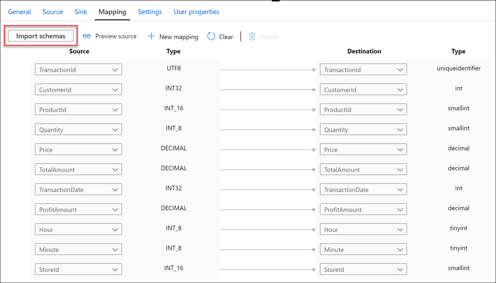

15. Select **Settings** and set the **Data integration unit** to `8`. This is required due to the large size of the source Parquet file.

    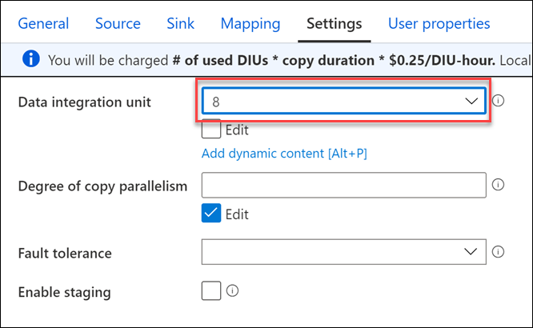

16. Select **Publish all** to save your new resources.

    

17. Select **Add trigger**, then **Trigger now**. Select **OK** in the pipeline run trigger to begin.

    

18. Navigate to the **Monitor** hub.

    

19. Select **Pipeline Runs**. You can see the status of your pipeline run here. Note that you may need to refresh the view. Once the pipeline run is complete, you can query the `wwi_staging.SaleHeap` table to view the imported data.

    
