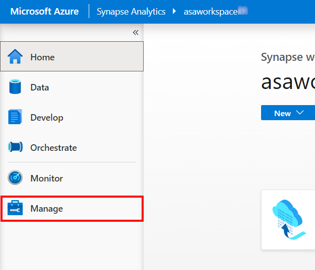
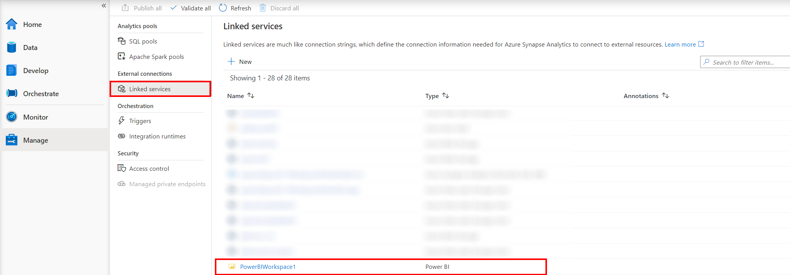

# Power BI in Synapse Analytics

## Resource naming throughout this lab

For the remainder of this guide, the following terms will be used for various ASA-related resources (make sure you replace them with actual names and values):

| Azure Synapse Analytics Resource  | To be referred to |
| --- | --- |
| Workspace resource group | `WorkspaceResourceGroup` |
| Workspace / workspace name | `Workspace` |
| Primary Storage Account | `PrimaryStorage` |
| Default file system container | `DefaultFileSystem` |
| SQL Pool | `SqlPool01` |

## Exercise 1 - Power BI and Synapse workspace integration

### Task 1 - Explore the Power BI linked service in Synapse Studio

1. Start from  [**Azure Synapse Studio**](<https://web.azuresynapse.net/>) and open the **Manage** hub from the left menu.

2. Beneath **External Connections**, select **Linked Services**, observe that a Linked Service pointing to a precreated Power BI workspace has already been configured in the environment.

Once your Azure Synapse and Power BI workspaces are linked, you can browse your Power BI datasets, edit/create new Power BI Reports directly from the Synapse Studio.

3. In  [**Azure Synapse Studio**](<https://web.azuresynapse.net/>) and navigate to the **Develop** hub using the left menu option.
   

4. Under **Power BI**, select the linked workspace (**Synapse 01** in the picture bellow) and observe that you have now access to your Power BI datasets and reports, directly from the Synapse Studio.

New reports can be created by selecting **+** at the top of the **Develop** tab. Existing reports can be edited by selecting the report name. Any saved changes will be written back to the Power BI workspace.
Next, let's explore the linked workspace in Power BI Portal

5. Sign in to the  [**Power BI Portal**](<https://app.powerbi.com/>) and select **Workspaces** from the left menu to check the existence of the Power BI workspace you have configured in the Synapse portal.

TODO: Architectural diagram of integration

### Task 4 - Create a new datasource with Power BI Desktop

1. In **Azure Synapse Studio** (<https://web.azuresynapse.net/>), select **Develop** from the left menu.

2. Beneath **Power BI**, select **Power BI datasets**.

3. Select **New Power BI dataset** from the top navigation menu.

4. Select **Start** and make sure you have Power BI desktop installed on your environment machine.

5. Next, select **SQLPool01** as the data source for your Power BI report. You'll be able to select tables from this pool when creating your dataset.

6. Select **Download** to save the **01SQLPool01.pbids** file on your local drive and then select **Continue**.
 

7. Select **Close and refresh** to close the publishing dialog.

### Task 5 - Create a new Power BI report in Synapse Studio

1. Open the .pbids file **Power BI desktop**.

## Exercise 2 - Optimizing integration with Power BI

### Task 1 - Explore Power BI optimization options
- diagram in slide deck
  
- In-memory
- Dual table
- DirectQuery

### Task 2 - Improve performance with materialized views
-use report from exercise 1 with direct query
- take note of execution time and query plan
- create materialized view
- take note of improved execution time and query plan
  (lab 3 or 4 to check)

### Task 3 - Improve performance with result-set caching

-use report from exercise 1 with direct query
- take note of execution time and query plan
- activate result-set caching
- take note of improved execution time and query plan
  (lab 3 or 4 to check)