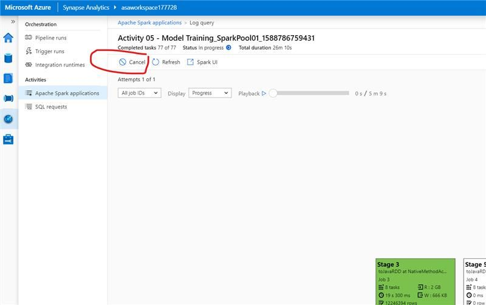

# Labs FAQ

### **Q**: _In Machine Learning labs, data is fetched from SQLPool01 using SparkPool compute. What's the advantage of pulling data from SQlPool as opposed to ADLS Gen2??_

**A**: It mostly depends on where the data for the Machine Learning process resides. Sometimes you will get it from SQL pools. Sometimes it will just be available in the semi-structured form in storage. The good thing here is that you do have options to handle any of these cases. The challenge is to identify, on a case-by-case level, which is the "right" thing to do when it comes to prepping data for ML processes. When it comes to ML processes, the pulling of the data is usually not a determining factor in the overall performance (read duration) of the process. The things you do after you pulled the data are, in most cases, the time-consuming ones (cleansing, missing values handling, feature enrichment, and feature engineering, etc.).

---

### **Q**: _I'm continually getting Error "Started executing query at Line 1. Failed to execute query. Error: HdfsBridge::recordReaderFillBuffer - Unexpected error encountered filling record reader buffer: OutOfMemoryError: Direct buffer memory. Total execution time: 00:00:27.961" trying to load data into [wwi_staging].[SaleHeap] or wwi_staging.Sale (for at least last 30 min)._

**A**: We see that sometimes happening with larger Parquet files. Check the size of the Parquet files and try with smaller ones.

---

### **Q**: _It says SQLPool is currently paused, is there anyway to restart it?_

**A**: You can always resume or pause the pool here:

---

### **Q**: _Getting error “UsageError: %%spark is not a line magic.”_

**A**: Make sure the language used in the cell and the global language setting on the notebook match.

---

### **Q**: _Cannot start Spark session for lab 07_

**A**: With our current lab resource structure during these capacity constrained times, we need to bring your attention to two critical steps for execution of Lab 07. Please perform the following two steps;

1. Go to `Apache Spark applications`

2. Click on the running session, wait 30 seconds for it to load and then cancel  it

That will free up resources to start Lab 07.

---

### **Q**: _Some of the queries in the “performance tuning” labs run much faster when run more than once, even when the result set caching is turned off. Is there an explanation for this?_

**A**: SQL Pools cache hot data that is being accessed frequently. This is separate from the result cache. DBCC DROPCLEANBUFFERS will clear the cache.

---

### **Q**: _During Lab 02 can’t delete AzureLargeComputeOptimizedIntegrationRuntime._

**A**: When this happens, instruct the attendees to perform the following steps:

1. Remove the DeleteLock from the resource group level.
2. Delete the AzureLargeComputeOptimizedIntegrationRuntime manually from Synapse Studio
3. Add back the DeleteLock delete lock at the resource group level

It is essential to delete the integration runtime instead of just reusing the existing one because we found that when automated delete fails, the integration runtime remains in a weird state (Synapse Studio says 'Delete failed' state).

---

### **Q**: _?_

**A**: 

---
